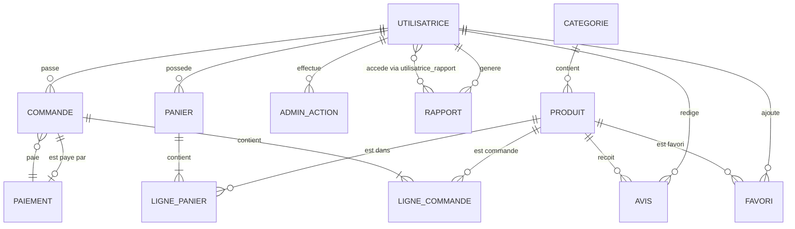

# 📊 MODÈLE CONCEPTUEL DE DONNÉES (MCD) - Feminine Aura

## 🎯 Vue d'ensemble

Base de données relationnelle pour une boutique e-commerce de lingerie avec gestion complète des produits, commandes, utilisateurs et analytics.

**SGBD** : MySQL 8.0
**Charset** : utf8mb4_unicode_ci
**Moteur** : InnoDB (support transactions et clés étrangères)

---

## 📐 Diagramme Entité-Association (Mermaid)



---

## 🔗 Relations Détaillées

### 1. UTILISATRICE ↔ PANIER (1:1)
**Cardinalité** : Un utilisateur possède UN SEUL panier
**Type** : Relation obligatoire
**Clé étrangère** : `panier.id_utilisatrice` → `utilisatrice.id_utilisatrice` (UNIQUE)
**Suppression** : CASCADE (si utilisateur supprimé, son panier l'est aussi)

---

### 2. UTILISATRICE ↔ COMMANDE (1:N)
**Cardinalité** : Un utilisateur peut passer PLUSIEURS commandes
**Type** : Relation obligatoire
**Clé étrangère** : `commande.id_utilisatrice` → `utilisatrice.id_utilisatrice`
**Suppression** : CASCADE

---

### 3. UTILISATRICE ↔ AVIS (1:N)
**Cardinalité** : Un utilisateur peut rédiger PLUSIEURS avis
**Type** : Relation obligatoire
**Contrainte** : Un utilisateur ne peut laisser qu'UN SEUL avis par produit
**Clé étrangère** : `avis.id_utilisatrice` → `utilisatrice.id_utilisatrice`
**Suppression** : CASCADE

---

### 4. UTILISATRICE ↔ FAVORI (1:N)
**Cardinalité** : Un utilisateur peut ajouter PLUSIEURS favoris
**Type** : Relation obligatoire
**Contrainte** : Un utilisateur ne peut ajouter qu'UNE FOIS le même produit en favori
**Clé étrangère** : `favori.id_utilisatrice` → `utilisatrice.id_utilisatrice`
**Suppression** : CASCADE

---

### 5. UTILISATRICE ↔ ADMIN_ACTION (1:N)
**Cardinalité** : Un admin peut effectuer PLUSIEURS actions
**Type** : Relation obligatoire (réservée aux admins)
**Clé étrangère** : `admin_action.id_utilisatrice` → `utilisatrice.id_utilisatrice`
**Suppression** : CASCADE

---

### 6. UTILISATRICE ↔ RAPPORT (1:N + N:M)
**Cardinalité** :
- Un admin génère PLUSIEURS rapports (1:N via `genere_par`)
- Plusieurs admins accèdent à plusieurs rapports (N:M via `utilisatrice_rapport`)

**Clés étrangères** :
- `rapport.genere_par` → `utilisatrice.id_utilisatrice`
- `utilisatrice_rapport.id_utilisatrice` → `utilisatrice.id_utilisatrice`
- `utilisatrice_rapport.id_rapport` → `rapport.id_rapport`

**Suppression** :
- `genere_par` : SET NULL (le rapport reste même si l'admin est supprimé)
- `utilisatrice_rapport` : CASCADE

---

### 7. CATEGORIE ↔ PRODUIT (1:N)
**Cardinalité** : Une catégorie contient PLUSIEURS produits
**Type** : Relation obligatoire
**Clé étrangère** : `produit.id_categorie` → `categorie.id_categorie`
**Suppression** : CASCADE (si catégorie supprimée, tous ses produits le sont aussi)

---

### 8. PRODUIT ↔ LIGNE_PANIER (1:N)
**Cardinalité** : Un produit peut être dans PLUSIEURS paniers
**Type** : Relation obligatoire
**Contrainte** : Un produit ne peut apparaître qu'UNE FOIS dans le même panier
**Clé étrangère** : `ligne_panier.id_produit` → `produit.id_produit`
**Suppression** : CASCADE

---

### 9. PRODUIT ↔ LIGNE_COMMANDE (1:N)
**Cardinalité** : Un produit peut être commandé PLUSIEURS fois
**Type** : Relation obligatoire
**Clé étrangère** : `ligne_commande.id_produit` → `produit.id_produit`
**Suppression** : CASCADE

---

### 10. PRODUIT ↔ AVIS (1:N)
**Cardinalité** : Un produit peut recevoir PLUSIEURS avis
**Type** : Relation obligatoire
**Contrainte** : Un utilisateur ne peut laisser qu'UN SEUL avis par produit
**Clé étrangère** : `avis.id_produit` → `produit.id_produit`
**Suppression** : CASCADE

---

### 11. PRODUIT ↔ FAVORI (1:N)
**Cardinalité** : Un produit peut être ajouté en favori par PLUSIEURS utilisateurs
**Type** : Relation obligatoire
**Clé étrangère** : `favori.id_produit` → `produit.id_produit`
**Suppression** : CASCADE

---

### 12. PANIER ↔ LIGNE_PANIER (1:N)
**Cardinalité** : Un panier contient PLUSIEURS lignes (articles)
**Type** : Relation obligatoire
**Clé étrangère** : `ligne_panier.id_panier` → `panier.id_panier`
**Suppression** : CASCADE

---

### 13. COMMANDE ↔ PAIEMENT (N:1)
**Cardinalité** : Une commande est payée par UN SEUL paiement
**Type** : Relation facultative (le paiement peut être en attente)
**Clé étrangère** : `commande.id_paiement` → `paiement.id_paiement`
**Suppression** : SET NULL (la commande reste même si le paiement est supprimé)

---

### 14. COMMANDE ↔ LIGNE_COMMANDE (1:N)
**Cardinalité** : Une commande contient PLUSIEURS lignes (articles commandés)
**Type** : Relation obligatoire
**Clé étrangère** : `ligne_commande.id_commande` → `commande.id_commande`
**Suppression** : CASCADE

---

## 📊 Statistiques de la Base de Données

| Statistique | Valeur |
|-------------|--------|
| **Nombre total de tables** | 13 |
| **Nombre d'entités principales** | 5 (Utilisatrice, Produit, Catégorie, Commande, Paiement) |
| **Nombre de tables de liaison** | 5 (Ligne_Panier, Ligne_Commande, Favori, Avis, Utilisatrice_Rapport) |
| **Nombre de tables de gestion** | 3 (Panier, Admin_Action, Rapport) |
| **Nombre de relations** | 14 |
| **Relations 1:1** | 1 (Utilisatrice ↔ Panier) |
| **Relations 1:N** | 12 |
| **Relations N:M** | 1 (Utilisatrice ↔ Rapport) |
| **Nombre de clés étrangères** | 20 |
| **Nombre de contraintes UNIQUE** | 8 |
| **Nombre d'index** | 28 |

---

## 🎯 Entités Principales

### 1. 👤 UTILISATRICE
**Description** : Utilisateurs du système (clients et administrateurs)
**Rôles** : `client`, `admin`
**Relations** : Panier (1:1), Commandes (1:N), Avis (1:N), Favoris (1:N)

### 2. 📦 PRODUIT
**Description** : Articles vendus sur la boutique
**Attributs clés** : Prix, Stock, Couleur, Taille, Tissu
**Relations** : Catégorie (N:1), Lignes panier/commande (1:N), Avis (1:N), Favoris (1:N)

### 3. 📁 CATEGORIE
**Description** : Classification des produits
**Identifiant** : Slug unique (URL-friendly)
**Relations** : Produits (1:N)

### 4. 🛒 COMMANDE
**Description** : Commandes passées par les clients
**Statuts** : `en_attente`, `confirmee`, `en_preparation`, `expediee`, `livree`, `annulee`
**Relations** : Utilisatrice (N:1), Paiement (N:1), Lignes (1:N)

### 5. 💳 PAIEMENT
**Description** : Transactions financières
**Modes** : `carte`, `paypal`, `virement`
**Statuts** : `en_attente`, `complete`, `echoue`, `rembourse`
**Relations** : Commandes (1:N)

---

## 🔒 Contraintes d'Intégrité

### Contraintes de Domaine
- **Note avis** : Entre 1 et 5 étoiles (CHECK)
- **Email** : Format valide, UNIQUE
- **Slug catégorie** : Format URL, UNIQUE
- **Numéro commande** : Format unique
- **Transaction ID** : UNIQUE (paiements)

### Contraintes d'Entité
- **Clés primaires** : Toutes les tables ont une PK auto-incrémentée
- **NOT NULL** : Champs obligatoires définis
- **DEFAULT** : Valeurs par défaut pour statuts et dates

### Contraintes Référentielles
- **CASCADE** : Suppression en cascade pour données dépendantes
- **SET NULL** : Conservation des données historiques (paiements, rapports)
- **UNIQUE composites** :
  - Un utilisateur = un panier
  - Un utilisateur = un avis par produit
  - Un utilisateur = un favori par produit
  - Un panier = un produit unique par ligne

---

## 🎨 Design Patterns Appliqués

### 1. **One-to-One avec Table Séparée** (Panier)
Pourquoi une table séparée pour le panier ?
- Séparation des préoccupations
- Possibilité d'historique futur
- Flexibilité pour paniers invités

### 2. **Table de Liaison avec Attributs** (Ligne_Panier, Ligne_Commande)
Attributs supplémentaires :
- `quantite` - Nombre d'articles
- `prix_unitaire` - Prix au moment de l'ajout
- `sous_total` - Calcul pré-stocké (Ligne_Commande)

### 3. **Audit Trail** (Admin_Action)
Traçabilité complète des actions administratives :
- Qui (id_utilisatrice)
- Quoi (action)
- Où (table_concernee)
- Quand (date_action)
- Détails (JSON)

### 4. **Soft Delete via Statut** (Commande, Produit)
Pas de suppression réelle :
- Produit : `actif = FALSE`
- Commande : `statut = 'annulee'`

### 5. **Normalisation 3NF**
Pas de redondance :
- Prix unitaire stocké dans lignes de commande (historique)
- Informations produit référencées, pas dupliquées

---

## 🚀 Optimisations

### Index Créés

**Recherche par email** (Login fréquent) :
```sql
INDEX idx_email ON utilisatrice(email)
```

**Recherche produits par catégorie** :
```sql
INDEX idx_categorie ON produit(id_categorie)
INDEX idx_slug ON categorie(slug)
```

**Filtre par prix** :
```sql
INDEX idx_prix ON produit(prix)
```

**Recherche de commandes** :
```sql
INDEX idx_numero ON commande(numero_commande)
INDEX idx_statut ON commande(statut_commande)
INDEX idx_date ON commande(date_commande)
```

**Avis produits** :
```sql
INDEX idx_produit ON avis(id_produit)
INDEX idx_note ON avis(note)
INDEX idx_approuve ON avis(approuve)
```

---

## 📈 Cas d'Usage

### Utilisateur Client

1. **Inscription / Connexion**
   - INSERT dans `utilisatrice`
   - CREATE automatique du `panier`

2. **Navigation Produits**
   - SELECT avec JOIN `produit` ↔ `categorie`
   - Filtres : prix, taille, couleur

3. **Ajout au Panier**
   - INSERT dans `ligne_panier`
   - UPDATE `quantite` si déjà présent

4. **Ajout aux Favoris**
   - INSERT dans `favori`
   - Toggle : DELETE si existe, INSERT sinon

5. **Passer Commande**
   - INSERT `paiement`
   - INSERT `commande` avec `id_paiement`
   - INSERT N lignes dans `ligne_commande`
   - DELETE toutes les `ligne_panier`

6. **Laisser un Avis**
   - INSERT dans `avis`
   - Contrainte : un seul avis par produit

---

### Administrateur

1. **Gérer Produits (CRUD)**
   - CREATE : INSERT `produit`
   - READ : SELECT avec JOIN `categorie`
   - UPDATE : UPDATE `produit`
   - DELETE : Soft delete (`actif = FALSE`) ou CASCADE

2. **Gérer Commandes**
   - SELECT avec JOIN `utilisatrice`, `paiement`
   - UPDATE `statut_commande`

3. **Voir Statistiques**
   - SELECT COUNT, SUM, AVG
   - Groupement par période, catégorie

4. **Générer Rapports**
   - INSERT `rapport` avec données JSON
   - INSERT `utilisatrice_rapport` (accès)

5. **Historique Actions**
   - Automatique via triggers (futur)
   - Ou INSERT manuel dans `admin_action`

---

## ✅ Avantages du Schéma

1. ✅ **Normalisation complète** (3NF) - Pas de redondance
2. ✅ **Intégrité référentielle** - Cascades et SET NULL appropriés
3. ✅ **Audit trail** - Historique des actions admin
4. ✅ **Performance** - Index sur colonnes fréquemment requêtées
5. ✅ **Flexibilité** - Support multi-modes de paiement
6. ✅ **Évolutivité** - Rapports JSON pour données non structurées
7. ✅ **Sécurité** - Rôles utilisateurs, mot de passe hashé
8. ✅ **Traçabilité** - Timestamps automatiques

---

## ⚠️ Points d'Attention

### Concurrence

**Problème** : Deux utilisateurs achètent le dernier article en stock
**Solution** : Transaction avec lock :
```sql
START TRANSACTION;
SELECT stock FROM produit WHERE id_produit = ? FOR UPDATE;
-- Vérifier stock > 0
UPDATE produit SET stock = stock - ? WHERE id_produit = ?;
COMMIT;
```

### Performance

**Requête lourde** : Produits avec moyenne des avis
**Solution** : Créer une vue matérialisée ou cache applicatif

### Cohérence

**Problème** : Prix produit change après commande
**Solution** : `prix_unitaire` stocké dans `ligne_commande` (snapshot)

---

## 🔮 Évolutions Futures Possibles

1. **Table PROMOTION** - Codes promo, réductions
2. **Table ADRESSE** - Adresses de livraison multiples
3. **Table STOCK_MOUVEMENT** - Historique des mouvements de stock
4. **Table NOTIFICATION** - Alertes utilisateurs
5. **Table IMAGE_PRODUIT** - Galerie d'images multiple
6. **Table VARIANTE_PRODUIT** - Gestion stock par couleur/taille
7. **Table RETOUR** - Gestion des retours produits
8. **Table NEWSLETTER** - Abonnements newsletters

---

**Date de création** : Décembre 2024
**Version** : 1.0
**Auteur** : Équipe Feminine Aura
